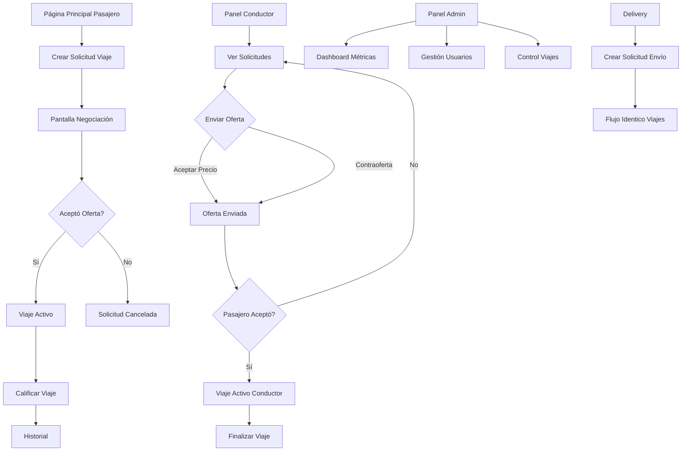

## 1. Product Overview
Sistema MVP de movilidad urbana tipo inDrive para mercados locales. Los pasajeros publican solicitudes de viaje con precio propuesto, los conductores aceptan o negocian, con seguimiento completo del viaje hasta su finalización.

Plataforma replicable que conecta pasajeros y conductores mediante modelo de negociación directa sin pricing automático, ideal para implementación local con control administrativo completo.

## 2. Core Features

### 2.1 User Roles
| Role | Registration Method | Core Permissions |
|------|---------------------|------------------|
| Pasajero | Email + contraseña | Crear viajes, ver conductores cercanos, aceptar/rechazar ofertas, calificar viajes |
| Conductor | Email + contraseña | Ver solicitudes cercanas, enviar ofertas, gestionar estado online/offline, completar viajes |
| Administrador | Panel admin único | Gestionar usuarios, forzar cancelaciones, ver métricas, control total del sistema |

### 2.2 Feature Module
Nuestro sistema de movilidad consiste en las siguientes páginas principales:

1. **Página Principal Pasajero**: mapa interactivo, selección pickup/dropoff, precio recomendado editable, opciones de viaje (mascotas, +4 personas), lista de conductores cercanos
2. **Página de Negociación**: pantalla de carga mostrando ofertas entrantes, detalles de conductores, aceptar/declinar ofertas
3. **Panel Conductor**: estado online/offline, lista de solicitudes cercanas con filtros, detalle de solicitudes, envío de ofertas
4. **Viaje Activo**: seguimiento del viaje asignado, chat integrado, finalización del viaje, calificación
5. **Perfil de Usuario**: información personal, historial de viajes, calificación promedio, configuración
6. **Panel Admin**: dashboard con métricas, gestión de usuarios, control de viajes activos, reportes
7. **Delivery**: página dedicada para envíos con mismo flujo de negociación que viajes

### 2.3 Page Details
| Page Name | Module Name | Feature description |
|-----------|-------------|---------------------|
| Página Principal Pasajero | Mapa Interactivo | Mostrar ubicación actual, permitir selección de pickup/dropoff con pins, calcular distancia y tiempo estimado usando fórmula Haversine |
| Página Principal Pasajero | Formulario de Solicitud | Ingresar direcciones manualmente, ajustar precio recomendado, seleccionar opciones (mascotas, +4 personas), crear solicitud de viaje |
| Página Principal Pasajero | Conductores Cercanos | Mostrar lista/cards de conductores disponibles con foto, nombre, calificación, distancia en tiempo real mediante short polling |
| Página de Negociación | Pantalla de Ofertas | Mostrar todas las ofertas recibidas con detalles del conductor, precio ofrecido, tiempo de llegada estimado |
| Página de Negociación | Acciones de Negociación | Aceptar oferta seleccionada, rechazar ofertas individuales, timer de decisión configurable |
| Panel Conductor | Control de Estado | Toggle online/offline, mostrar estado actual, bloquear acciones cuando está offline |
| Panel Conductor | Lista de Solicitudes | Cards con información del pasajero, pickup/dropoff, precio propuesto, distancia, botones de acción |
| Panel Conductor | Envío de Ofertas | Formulario para aceptar precio o enviar contraoferta, confirmación antes de enviar |
| Viaje Activo | Seguimiento | Mostrar estado actual del viaje, ubicación del conductor (simulada), tiempo estimado de llegada |
| Viaje Activo | Chat | Enviar y recibir mensajes de texto, historial del chat, solo disponible en estados ASSIGNED/IN_PROGRESS |
| Viaje Activo | Finalización | Botón para finalizar viaje, confirmación de precio final, redirección a calificación |
| Perfil de Usuario | Información Personal | Mostrar nombre, email, teléfono, foto de perfil, calificación promedio, opción de editar |
| Perfil de Usuario | Historial | Lista de viajes completados con fecha, origen/destino, precio, estado, acceso a detalles |
| Panel Admin | Dashboard | Métricas principales: viajes hoy, completados vs cancelados, usuarios activos, gráficos de barras/líneas |
| Panel Admin | Gestión Usuarios | Tabla con filtros, acciones de bloquear/desbloquear, cambio de roles, búsqueda por email/nombre |
| Panel Admin | Control Viajes | Lista de viajes activos, forzar cancelación, ver detalles completos, filtros por estado |
| Delivery | Solicitud de Envío | Mismo flujo que viajes pero para paquetes, incluir dimensiones y peso aproximado |
| Delivery | Negociación | Flujo idéntico a viajes con conductores especializados en delivery |

## 3. Core Process

### Flujo del Pasajero
El pasajero accede a la página principal, elige sus puntos de recogida y destino en el mapa o ingresando direcciones. El sistema calcula un precio recomendado basado en distancia que el usuario puede modificar. Selecciona opciones adicionales como mascotas o más de 4 personas, luego crea la solicitud. Durante el período de negociación, ve una pantalla de espera mostrando las ofertas de conductores en tiempo real mediante short polling. Puede aceptar la oferta que prefiera o rechazarlas. Una vez aceptada, ve el progreso del viaje con ubicación del conductor y puede chatear durante el trayecto. Al finalizar, califica el viaje del 1-5.

### Flujo del Conductor
El conductor se pone online en su panel y ve una lista de solicitudes cercanas actualizada cada 5 segundos. Cada solicitud muestra información del pasajero, rutas y precio propuesto. Puede aceptar el precio directamente o enviar una contraoferta. Una vez que un pasajero acepta su oferta, recibe notificación y accede al viaje activo donde puede iniciar el trayecto, ver la ruta y comunicarse por chat. Al llegar al destino, finaliza el viaje y recibe la calificación.

### Flujo del Administrador
El admin accede a un dashboard con métricas clave del sistema. Puede gestionar usuarios bloqueándolos o cambiándoles roles, ver todos los viajes activos con opción de forzar cancelación, y acceder a reportes detallados con filtros por fecha y estado.

### Flujo de Delivery
Identico al flujo de viajes pero con lógica separada para envíos de paquetes, incluyendo campos adicionales para dimensiones y peso.

## 4. User Interface Design

### 4.1 Design Style
- **Colores Primarios**: Azul profesional (#2563EB) para acciones principales, verde (#10B981) para estados exitosos
- **Colores Secundarios**: Gris neutro (#6B7280) para textos, rojo (#EF4444) para errores/alertas
- **Botones**: Estilo rounded-lg con sombras suaves, hover effects con transiciones de 200ms
- **Tipografía**: Inter para headers (semibold), System UI para body text
- **Tamaños**: Headers 24-32px, body 14-16px, botones 16px con padding generoso
- **Layout**: Card-based con bordes redondeados y sombras sutiles, navegación superior sticky
- **Iconos**: Heroicons outline consistentes, emojis moderados solo en estados vacíos

### 4.2 Page Design Overview
| Page Name | Module Name | UI Elements |
|-----------|-------------|-------------|
| Página Principal Pasajero | Mapa Interactivo | Mapa full-height con overlay de controles, pins drag-and-drop, card flotante para direcciones, botón primario destacado para crear solicitud |
| Página de Negociación | Lista de Ofertas | Cards horizontales con foto circular del conductor, estrellas de calificación, badge de tiempo estimado, botones de acción en fila |
| Panel Conductor | Grid de Solicitudes | Layout responsive 2-3 columnas en desktop, cards con borde izquierdo color según distancia, iconos para pickup/dropoff |
| Viaje Activo | Status Header | Barra superior con estado actual, tiempo estimado, botón de chat flotante, mapa con ruta resaltada |
| Panel Admin | Dashboard | Gráficos de Chart.js con paleta de colores consistente, tablas con zebra-striping, filtros en sidebar collapsible |

### 4.3 Responsiveness
Desktop-first con breakpoints en 768px y 1024px. En móviles: navegación inferior tipo tab bar, cards apiladas verticalmente, mapa ocupando 60% de viewport. Touch optimizado con áreas de clic mínimas de 44px.

### 4.4 Estados de Carga y Vacíos
- Skeleton loaders para listas y cards durante carga inicial
- Animaciones de pulso sutiles en elementos cargando
- Mensajes de estado vacío con iconos ilustrativos y call-to-action claro
- Spinners minimalistas para acciones individuales
- Feedback visual inmediato en todos los botones (color change + scale on click)