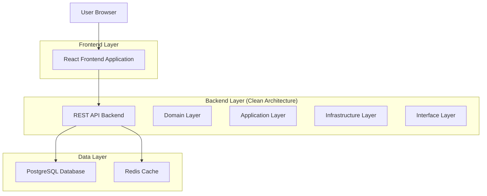
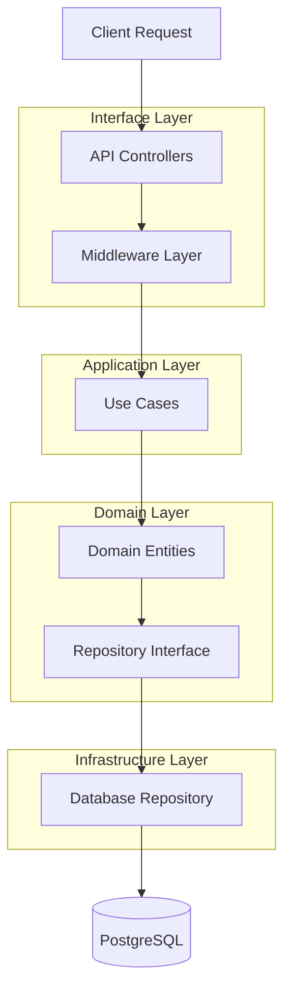
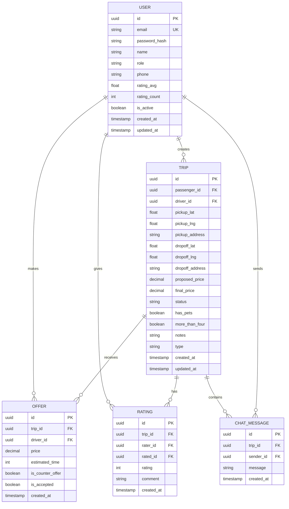

## 1. Architecture design



## 2. Technology Description
- Frontend: React@18 + tailwindcss@3 + vite
- Initialization Tool: vite-init
- Backend: Node.js@18 + Express@4 + TypeScript@5
- Database: PostgreSQL@14 con migraciones
- Cache: Redis@7 para sesiones y datos temporales
- ORM: Prisma para mapeo objeto-relacional
- Validación: Zod para esquemas de validación
- Autenticación: JWT + bcrypt para hash de contraseñas

## 3. Route definitions
| Route | Purpose |
|-------|---------|
| / | Home page para pasajeros con mapa y creación de solicitudes |
| /login | Login page con formulario de autenticación |
| /register | Registro de nuevos usuarios con selección de rol |
| /passenger | Dashboard principal del pasajero con mapa y solicitudes activas |
| /passenger/negotiation/:id | Pantalla de negociación mostrando ofertas de conductores |
| /passenger/trip/:id | Viaje activo con seguimiento y chat |
| /driver | Panel del conductor con lista de solicitudes y estado online |
| /driver/trip/:id | Viaje activo asignado al conductor |
| /profile | Perfil de usuario con historial y configuración |
| /delivery | Módulo de delivery con flujo similar a viajes |
| /admin | Panel administrativo con dashboard y gestión |
| /admin/users | Gestión de usuarios con filtros y acciones |
| /admin/trips | Control de viajes activos e históricos |

## 4. API definitions

### 4.1 Authentication APIs
```
POST /api/auth/register
```
Request:
| Param Name | Param Type | isRequired | Description |
|------------|-------------|-------------|-------------|
| email | string | true | Email del usuario |
| password | string | true | Contraseña (mínimo 6 caracteres) |
| name | string | true | Nombre completo |
| role | string | true | Rol: 'passenger', 'driver', 'admin' |
| phone | string | false | Teléfono opcional |

Response:
```json
{
  "token": "eyJhbGciOiJIUzI1NiIsInR5cCI6IkpXVCJ9...",
  "user": {
    "id": "uuid",
    "email": "user@example.com",
    "name": "Juan Pérez",
    "role": "passenger"
  }
}
```

```
POST /api/auth/login
```
Request:
| Param Name | Param Type | isRequired | Description |
|------------|-------------|-------------|-------------|
| email | string | true | Email del usuario |
| password | string | true | Contraseña |

### 4.2 Trip APIs
```
POST /api/trips/create
```
Request:
| Param Name | Param Type | isRequired | Description |
|------------|-------------|-------------|-------------|
| pickup_lat | number | true | Latitud del punto de recogida |
| pickup_lng | number | true | Longitud del punto de recogida |
| pickup_address | string | true | Dirección de recogida en texto |
| dropoff_lat | number | true | Latitud del destino |
| dropoff_lng | number | true | Longitud del destino |
| dropoff_address | string | true | Dirección de destino en texto |
| proposed_price | number | true | Precio propuesto por el pasajero |
| has_pets | boolean | false | Indica si lleva mascotas |
| more_than_four | boolean | false | Indica si van más de 4 personas |
| notes | string | false | Notas adicionales |

```
GET /api/trips/nearby
```
Query params:
| Param Name | Param Type | isRequired | Description |
|------------|-------------|-------------|-------------|
| lat | number | true | Latitud actual del conductor |
| lng | number | true | Longitud actual del conductor |
| radius | number | false | Radio de búsqueda en km (default: 5) |

### 4.3 Offer APIs
```
POST /api/offers/create
```
Request:
| Param Name | Param Type | isRequired | Description |
|------------|-------------|-------------|-------------|
| trip_id | string | true | ID del viaje |
| price | number | true | Precio ofrecido |
| estimated_time | number | false | Tiempo estimado de llegada en minutos |
| is_counter_offer | boolean | false | Indica si es contraoferta |

```
GET /api/offers/by-trip/:tripId
```
Response con array de ofertas incluyendo información del conductor.

## 5. Server architecture diagram



## 6. Data model

### 6.1 Data model definition


### 6.2 Data Definition Language

```sql
-- Users table
CREATE TABLE users (
    id UUID PRIMARY KEY DEFAULT gen_random_uuid(),
    email VARCHAR(255) UNIQUE NOT NULL,
    password_hash VARCHAR(255) NOT NULL,
    name VARCHAR(100) NOT NULL,
    role VARCHAR(20) NOT NULL CHECK (role IN ('passenger', 'driver', 'admin')),
    phone VARCHAR(20),
    rating_avg DECIMAL(3,2) DEFAULT 0.00,
    rating_count INTEGER DEFAULT 0,
    is_active BOOLEAN DEFAULT true,
    current_location_lat DECIMAL(10,8),
    current_location_lng DECIMAL(11,8),
    created_at TIMESTAMP WITH TIME ZONE DEFAULT NOW(),
    updated_at TIMESTAMP WITH TIME ZONE DEFAULT NOW()
);

-- Trips table
CREATE TABLE trips (
    id UUID PRIMARY KEY DEFAULT gen_random_uuid(),
    passenger_id UUID NOT NULL REFERENCES users(id),
    driver_id UUID REFERENCES users(id),
    pickup_lat DECIMAL(10,8) NOT NULL,
    pickup_lng DECIMAL(11,8) NOT NULL,
    pickup_address VARCHAR(255) NOT NULL,
    dropoff_lat DECIMAL(10,8) NOT NULL,
    dropoff_lng DECIMAL(11,8) NOT NULL,
    dropoff_address VARCHAR(255) NOT NULL,
    proposed_price DECIMAL(10,2) NOT NULL,
    final_price DECIMAL(10,2),
    status VARCHAR(20) NOT NULL CHECK (status IN ('CREATED', 'PUBLISHED', 'ASSIGNED', 'IN_PROGRESS', 'COMPLETED', 'CANCELLED')),
    has_pets BOOLEAN DEFAULT false,
    more_than_four BOOLEAN DEFAULT false,
    notes TEXT,
    type VARCHAR(20) DEFAULT 'trip' CHECK (type IN ('trip', 'delivery')),
    created_at TIMESTAMP WITH TIME ZONE DEFAULT NOW(),
    updated_at TIMESTAMP WITH TIME ZONE DEFAULT NOW()
);

-- Offers table
CREATE TABLE offers (
    id UUID PRIMARY KEY DEFAULT gen_random_uuid(),
    trip_id UUID NOT NULL REFERENCES trips(id),
    driver_id UUID NOT NULL REFERENCES users(id),
    price DECIMAL(10,2) NOT NULL,
    estimated_time INTEGER,
    is_counter_offer BOOLEAN DEFAULT false,
    is_accepted BOOLEAN DEFAULT false,
    created_at TIMESTAMP WITH TIME ZONE DEFAULT NOW(),
    UNIQUE(trip_id, driver_id)
);

-- Ratings table
CREATE TABLE ratings (
    id UUID PRIMARY KEY DEFAULT gen_random_uuid(),
    trip_id UUID NOT NULL REFERENCES trips(id),
    rater_id UUID NOT NULL REFERENCES users(id),
    rated_id UUID NOT NULL REFERENCES users(id),
    rating INTEGER NOT NULL CHECK (rating >= 1 AND rating <= 5),
    comment TEXT,
    created_at TIMESTAMP WITH TIME ZONE DEFAULT NOW(),
    UNIQUE(trip_id, rater_id)
);

-- Chat messages table
CREATE TABLE chat_messages (
    id UUID PRIMARY KEY DEFAULT gen_random_uuid(),
    trip_id UUID NOT NULL REFERENCES trips(id),
    sender_id UUID NOT NULL REFERENCES users(id),
    message TEXT NOT NULL,
    created_at TIMESTAMP WITH TIME ZONE DEFAULT NOW()
);

-- Indexes for performance
CREATE INDEX idx_users_email ON users(email);
CREATE INDEX idx_users_role ON users(role);
CREATE INDEX idx_users_active ON users(is_active);
CREATE INDEX idx_trips_passenger ON trips(passenger_id);
CREATE INDEX idx_trips_driver ON trips(driver_id);
CREATE INDEX idx_trips_status ON trips(status);
CREATE INDEX idx_trips_created ON trips(created_at DESC);
CREATE INDEX idx_offers_trip ON offers(trip_id);
CREATE INDEX idx_offers_driver ON offers(driver_id);
CREATE INDEX idx_offers_accepted ON offers(is_accepted);
CREATE INDEX idx_chat_messages_trip ON chat_messages(trip_id);
CREATE INDEX idx_chat_messages_created ON chat_messages(created_at);

-- Triggers for updated_at
CREATE OR REPLACE FUNCTION update_updated_at_column()
RETURNS TRIGGER AS $$
BEGIN
    NEW.updated_at = NOW();
    RETURN NEW;
END;
$$ language 'plpgsql';

CREATE TRIGGER update_users_updated_at BEFORE UPDATE ON users
    FOR EACH ROW EXECUTE FUNCTION update_updated_at_column();

CREATE TRIGGER update_trips_updated_at BEFORE UPDATE ON trips
    FOR EACH ROW EXECUTE FUNCTION update_updated_at_column();

-- Seed data
INSERT INTO users (email, password_hash, name, role, phone, rating_avg) VALUES
('admin@indrive.local', '$2b$10$rQZ9qF8xL6KoF3yH9Jl.XuK5vQ2NQL8KwMmMq2J5vG5z8QxJ8R6O', 'Administrador', 'admin', '+1234567890', 5.0),
('passenger1@demo.com', '$2b$10$rQZ9qF8xL6KoF3yH9Jl.XuK5vQ2NQL8KwMmMq2J5vG5z8QxJ8R6O', 'Juan Pérez', 'passenger', '+1234567891', 4.8),
('passenger2@demo.com', '$2b$10$rQZ9qF8xL6KoF3yH9Jl.XuK5vQ2NQL8KwMmMq2J5vG5z8QxJ8R6O', 'María García', 'passenger', '+1234567892', 4.5),
('driver1@demo.com', '$2b$10$rQZ9qF8xL6KoF3yH9Jl.XuK5vQ2NQL8KwMmMq2J5vG5z8QxJ8R6O', 'Carlos Rodríguez', 'driver', '+1234567893', 4.9),
('driver2@demo.com', '$2b$10$rQZ9qF8xL6KoF3yH9Jl.XuK5vQ2NQL8KwMmMq2J5vG5z8QxJ8R6O', 'Ana Martínez', 'driver', '+1234567894', 4.7);
```

## 7. Short Polling Strategy

Para reemplazar WebSockets, implementar short polling con intervalos optimizados:

- **Negociación de ofertas**: 3-5 segundos
- **Actualización de ubicación**: 10-15 segundos  
- **Estado de viaje activo**: 5-8 segundos
- **Lista de solicitudes conductor**: 5 segundos

Implementar lógica de backoff exponencial en caso de errores de red, con máximo de 30 segundos entre peticiones. Incluir timestamp de última actualización en cada respuesta para evitar procesamiento de datos duplicados.